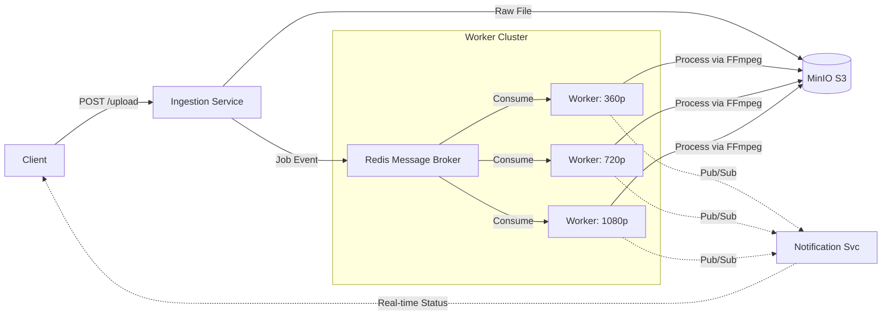

# Distributed Video Transcoding Pipeline

A high-throughput, fault-tolerant video processing architecture designed to handle large-scale media ingestion and transcoding. This project demonstrates **event-driven microservices**, **asynchronous task orchestration**, and **distributed system patterns**.

##  System Architecture

The system utilizes a producer-consumer pattern to decouple upload ingestion from CPU-intensive transcoding tasks.

## Technical Highlights
Event-Driven Architecture: Decoupled services communicating via Redis message queues (BullMQ).
Horizontal Scalability: Worker nodes are containerized and can be scaled independently based on load.
Resiliency: Implements automatic retry mechanisms and dead-letter queues for failed transcoding jobs.
Object Storage: S3-compatible storage integration (MinIO) for handling raw and processed media assets.
Real-Time Communication: WebSocket implementation for instant client-side progress updates.
Technology Stack
Core - Node.js, Express
Media Processing - FFmpeg
Infrastructure - Docker, Docker Compose
Data & Messaging - PostgreSQL, Redis, MinIO
Protocols - HTTP/REST, WebSockets
Quick Start -- Initialize the entire distributed stack with a single command.
# 1. Clone Repository
git clone [https://github.com/dkmenelf/video-transcoding-system.git](https://github.com/dkmenelf/video-transcoding-system.git)

# 2. Configure Environment
cp .env.example .env

# 3. Spin up Infrastructure (Database, Queue, S3, Services)
docker-compose up --build -d
API Endpoint: http://localhost:3000
MinIO Console: http://localhost:9001
